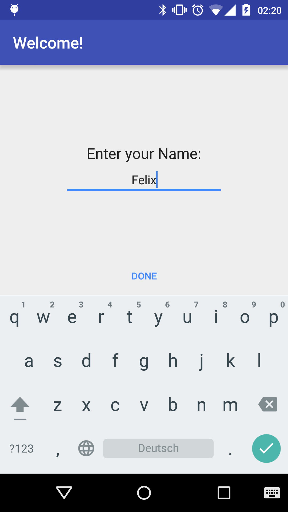
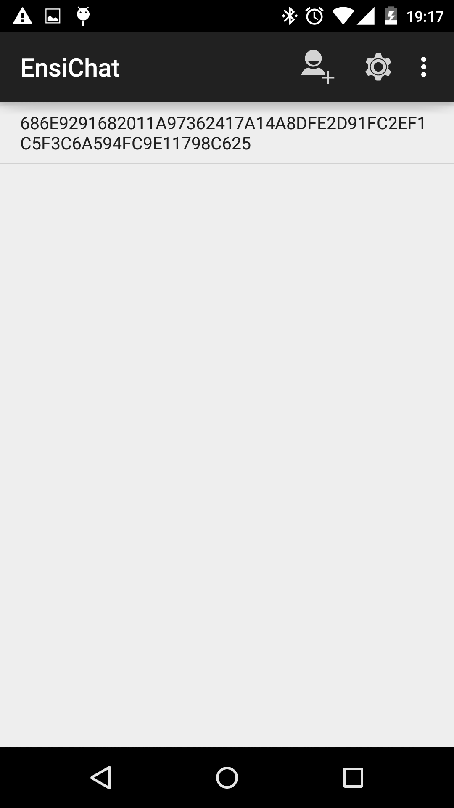
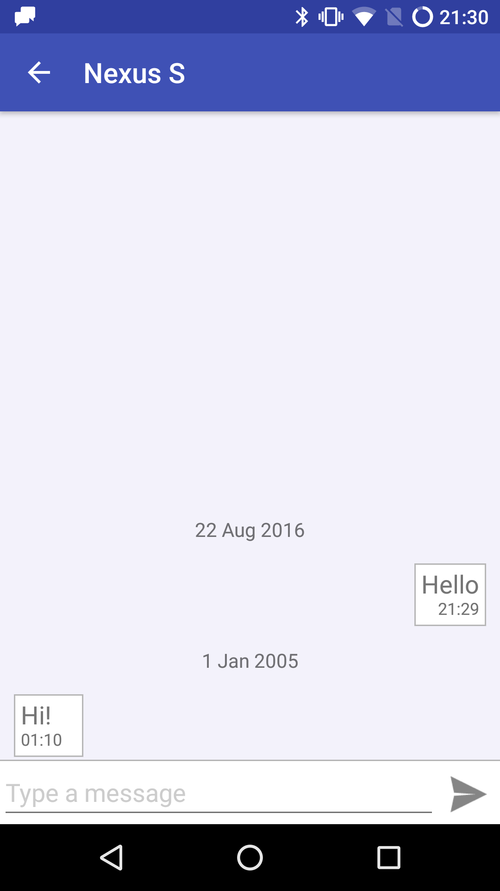

Ensichat
========

Instant messenger for Android that is fully decentralized, and uses strong end-to-end
encryption. Messages are sent directly between devices via Bluetooth or Internet, without any
central server. Relay nodes are used to ensure message delivery, even if the target node is 
offline.

For details on how Ensichat works, you can check out my [bachelor thesis](docs/bachelor-thesis.pdf), and
read the [protocol definition](PROTOCOL.md).

 

To set up a server, please follow the [instructions on the wiki](https://github.com/Nutomic/ensichat/wiki/Running-your-own-server).

Building
--------

To setup a development environment, just install [Android Studio](https://developer.android.com/sdk/)
and import the project.

Alternatively, you can use the command line. To create a debug apk, run `./gradlew assembleDevDebug`.
This requires at least Android Lollipop on your development device. If you don't have 5.0 or higher,
you have to use `./gradlew assembleRelDebug`. However, this results in considerably slower
incremental builds. To create a release apk, run `./gradlew assembleRelRelease`.

Testing
-------

You can run the unit tests with `./gradlew test`. After connecting an Android device, you can run
the Android tests with `./gradlew connectedDevDebugAndroidTest` (or
`./gradlew connectedRelDebugAndroidTest` if your Android version is  lower than 5.0).

To run integration tests for the core module, use `./gradlew integration:run`. If this fails (or
is very slow), try changing the value of Crypto#PublicKeySize to 512 (in the core module).

License
-------
The project is licensed under the [MPLv2](LICENSE).

The launcher icon is based on the [Bubbles Icon](https://www.iconfinder.com/icons/285667/bubbles_icon) created by [Paomedia](https://www.iconfinder.com/paomedia) which is available under [CC BY 3.0](http://creativecommons.org/licenses/by/3.0/).
