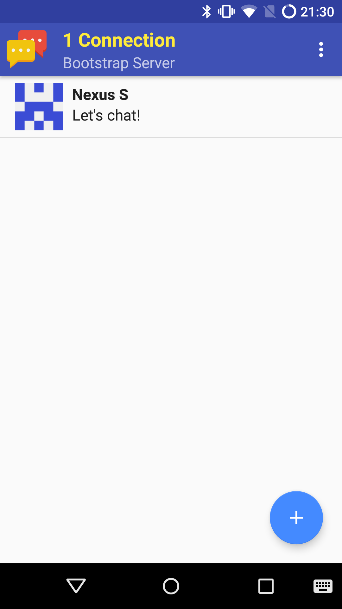

ensichat
========

Instant messanger for Android that is fully decentralized. Messages are sent directly between
devices via Bluetooth, without any central server. A simple flood-based routing is used for
message propagation.

 

Building
--------

To create a debug apk, run `./gradlew assembleDebug`. Alternatively, you can use
`.gradlew thinDebug` for a faster compile, but this requires Scala libraries installed
with [Android-Scala-Installer](https://github.com/Arneball/Android-Scala-Installer) on your device.

To create a release apk, run `./gradlew assembleRelease`.

License
-------

All code is licensed under the [GPL](LICENSE), v3 or later.
